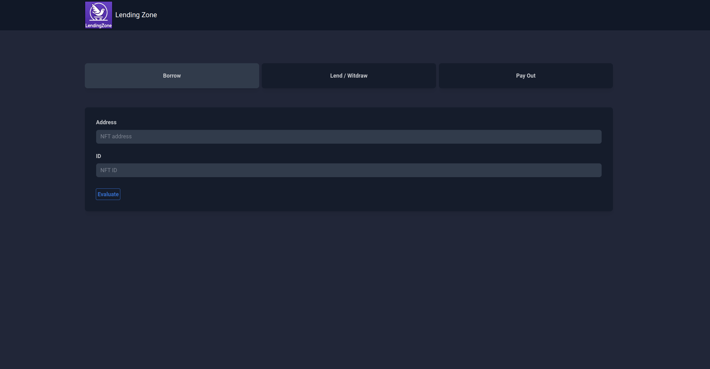
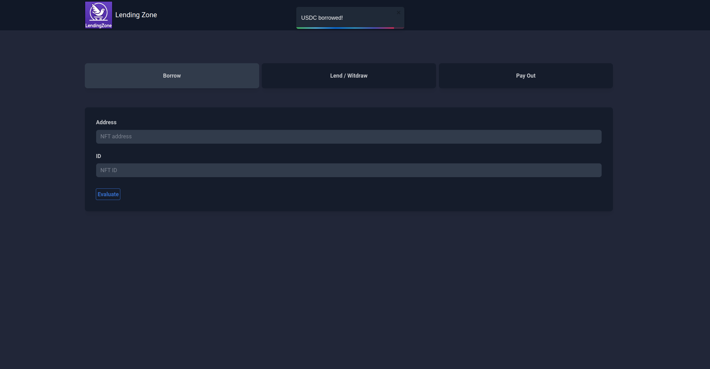
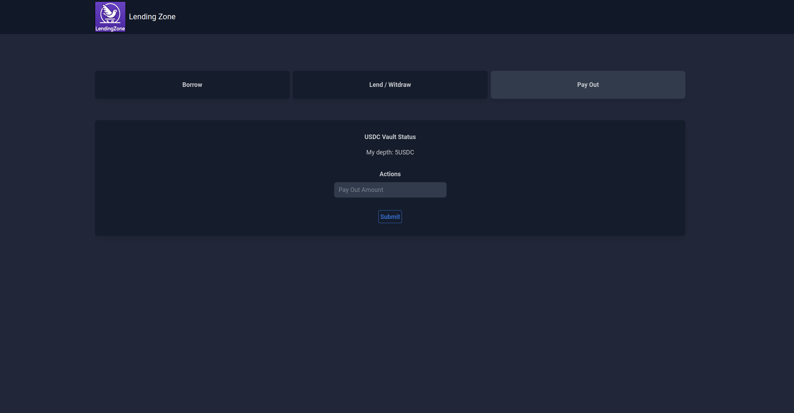
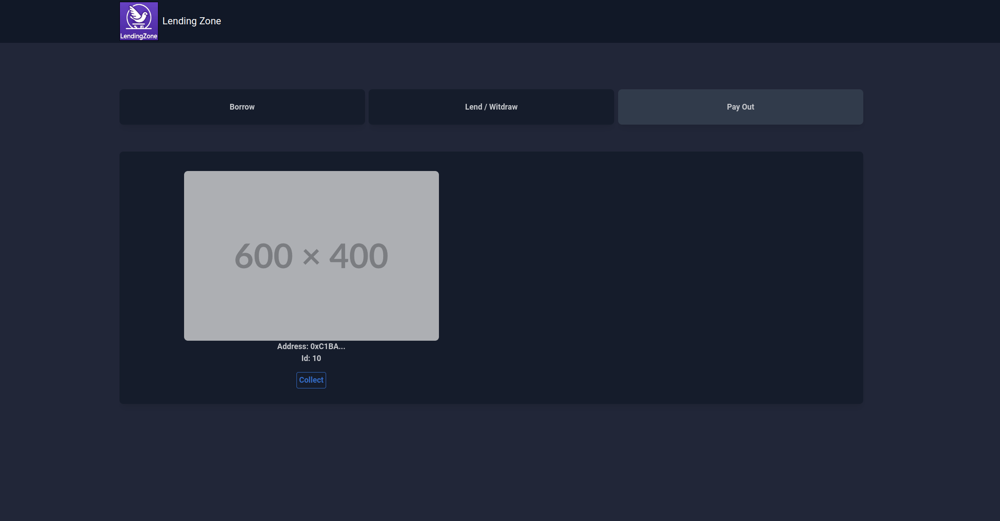
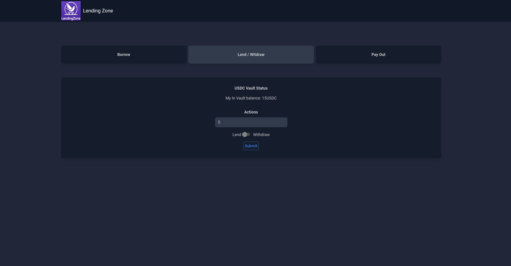

# Lending Zone

Our solution is a revolutionary decentralized finance (DeFi) application that enables users to borrow non-fungible tokens (NFTs) securely and efficiently.

## Overview
LendingZone provides a seamless platform for NFT enthusiasts to access and utilize digital assets without the need for traditional intermediaries. Experience the future of digital asset lending with LendingZone.

  
  

  
  

  

## Setup
### `npm install`

Installs all required dependencies.

### `npm start`

Runs the app in the development mode.\
Open [http://localhost:3000](http://localhost:3000) to view it in your browser.

### `npm run build`

Builds the app for production to the `build` folder.\
It correctly bundles React in production mode and optimizes the build for the best performance.

